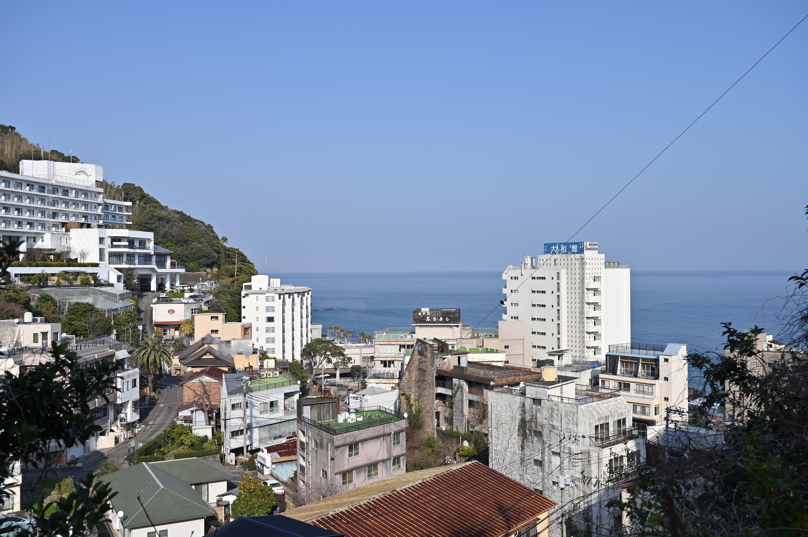

カメラを初めて約10年、カメラを本格的に趣味として初めて約3年が経ちました。

最近は風景写真に関する洞察が特に深まってきた気がしています。
その本流として「写真を幾何学的に捉えることに関する考え方の変化」があると思っています。

# 写真を幾何学的に捉えるとは

まず前提として写真と聞いて思い浮かべる図形は何でしょうか。
ぱっと思い浮かんだものは長方形ではないでしょうか。
それは単純にカメラのセンサーが長方形だからです。
ところが、このおかげで「写真を撮る」という動作のイメージにどうしても長方形がまとわりついてくるのです。
両手の親指と人差し指をクロスにして長方形にして画角を決めるポーズが有名ですが、このポーズも長方形に囚われています。

このイメージにとらわれている状態だと、何が問題なのでしょうか。問題だとしたら、どんなイメージにシフトするといい写真が撮れるようになるのでしょうか。
今回はその洞察について私見を語っていきます。

# 長方形の写真

一つ目の段階は長方形の写真です。
目の前に広がる景色をただ長方形に切り取るという発想です。
今になって振り返ると、このイメージでは特にいい写真は撮れません。
撮れたとしても典型的な構図を意識した写真くらいだと思います。

では、長方形のイメージのままでは何が問題になるのでしょうか。
それは、広角で撮った場合と望遠で撮った場合で撮れるイメージが全く異なることです。
単純に長方形で風景を切り取った場合、広角レンズで切り取ろうとすると視覚のイメージよりもどこか空間的な広さをより与えたものになります。反対に望遠レンズで撮ると、奥行き方向への広がりを与えたような視覚のイメージになります。
そのギャップにより、「思ったものと違った写真」がたくさん量産されることになるわけです。

# 直方体の写真

そこで新しく生まれたのが直方体のイメージです。
目の前に広がる風景に長方形ではなく、カメラのレンズにくっついた奥行きを持った直方体をあてはめていくのです。

その直方体の形はレンズによって変化します。広角にすればするほど縦と横に広がっていき、手前と奥方向には縮んでいき、望遠にすればするほど縦と横方向には縮んでいき、手前と奥方向には広がっていきます。その直方体の大きさはイメージで変化します。どういうイメージで撮りたいかに合わせて自由に変えてよいものです。変わらないのはその直方体がカメラの先端についているということだけです。

このようなイメージの世界で写真を撮ることを意識すると、どういうメリットがあるでしょうか。
例えば手前にあるアジサイを撮ることを考えます。
このアジサイをどう撮りたいかを直方体でイメージします。
なんとなくアジサイの周りの雰囲気を撮りたいんだというときは縦と横方向に広がっている直方体がそこにあてはまります。
その場合、寄って広角レンズが適切です。

さらに、奥に広がる景色も込みで、なんとなくその大きな広がりの中にいるアジサイを撮りたいという場合は、引きで広角レンズで撮ります。

そうではなく、植物の小さな蔓と遠くにある家との対比をうまく撮りたいんだというときは、縦と横方向に縮み、奥と手前方向に伸びた直方体がそこにあてはまります。この場合望遠レンズが適切です。

今思うと実際にできる写真から逆算することは簡単にできますが、実際に目の前に広がる景色を空間的に捉えて直方体で囲ってやるイメージがあるとできる写真のイメージを想像しなくても適切な雰囲気の写真を簡単にとることができます。

そういったイメージができあがってから半年以上経ち、しばらく上達が停滞していました。
その中で生まれた悩みが「その時の感動が写真には全く残らない」というものでした。

なぜ感動が写真に残らないのかを考えながらとっていた結果あることに気が付きました。
それは、「人間の目は見たいものを見ているだけだ」ということです。
目の前に広がる景色に感動した時にぼんやりと視覚に移っている景色はなんとなく長方形に見えていますが、感動しているときに本当に見ている部分はその中のほんの一握りでしかないということです。その部分を「見たいもの」と呼んでいます。

それをひらめくきっかけになった写真がこちらです。

朝日が木々の間から差し込んでいる様に大変感動してカメラを構えましたが、後で写真を見ると何も心が動きません。

いったいなぜなのでしょうか。この感動した部分を改めて言語化すると、「朝日が木々の間から差し込み一筋の帯を作っている様に大変感激した」となるわけです。つまり、「見たいもの」は木々と光の帯なのです。光の帯というのは、木々の間にある光の並びではなく、あくまでも帯ということです。
この場合で正しい写真の撮り方は、ピントをずらすことでした。ピントをずらすと光がぼやけて見えるために光がつながって見え、その感動イメージに近づくのです。

「見たいもの」と写真は常に同じとは限らず、むしろ違うことの方が多いことに気づいたのです。
その中で得た知見は、イメージは液体のようであるということです。

# 液体の写真

人間が見たいものは長方形でも直方体でもなく、ぐにゃぐにゃとした水のような形をしているのです。
つまり、長方形の写真にそれを収めることにそもそも無理があるということです。

では、なにをしたらいいのでしょうか。
それは、感動した時に何に感動してるのかを自問自答することです。
感動した瞬間にシャッターを切るのではなく、感動した時に何に感動したかを理解し、そこに向け直してシャッターを切るということです。

よくあるパターンは、「見たいもの」が道路のずっと奥にしかないパターンです。
そのパターンでなんとなくシャッターを切るとただの道路の写真にしかなりません。望遠レンズでそのずっと奥だけを切り取るようにするとその感動が写真に納まるというわけです。

次によくあるパターンは、「見たいもの」が中心にないパターンです。
この場合は、「見たいもの」が中心になるようにちょっとずらして拡大するだけで印象的な写真になりやすいです。

ここであえて「液体」としたのは、自由な形を作るという要素に加えて、動きがあるからです。

こちらの写真を撮ったときのことです。なんとなくこの景色に感動したのでシャッターを切りましたがいまいちでした。

こういう時はなんとなくカメラを下に向けるとよさそうな写真が撮れた気がしたのでそれに従って撮ってみました。まさに、感動が写真に残り、狙い通りです。

なぜ狙い通りになったのでしょうか。この感動を思い出して言語化すると、「高いところから見たときに感じる温泉街の空間の豊かさ」です。
しかし、最初に撮った写真からそれはなかなか感じません。それは、単純に感動したタイミングでシャッターを切ったからです。
そもそも、人間の目は止まっていません。動きがあります。色々な角度からみて空間を頭の中に作ることができます。色々な角度から見て空間のイメージが頭にできて初めて心を動かされるということは今までにたくさんあったのかもしれません。

イメージは液体のように流れて行って視界の外にまであふれ出るということです。
感動したタイミングでどのような視線の動かし方をしたかを思い出して、その足掛かりになるような角度に向けなおすということがこのイメージで撮るコツといえるでしょう。

このように、写真と向き合い続けることで人間の物の見方もわかり、さらにいい写真を撮るきっかけにつながっていきます。
これからも妥協することなく写真を撮っていきたいものです。