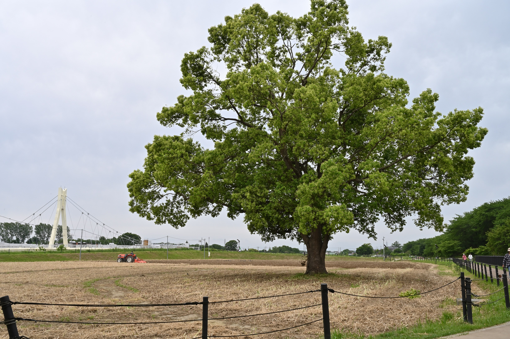
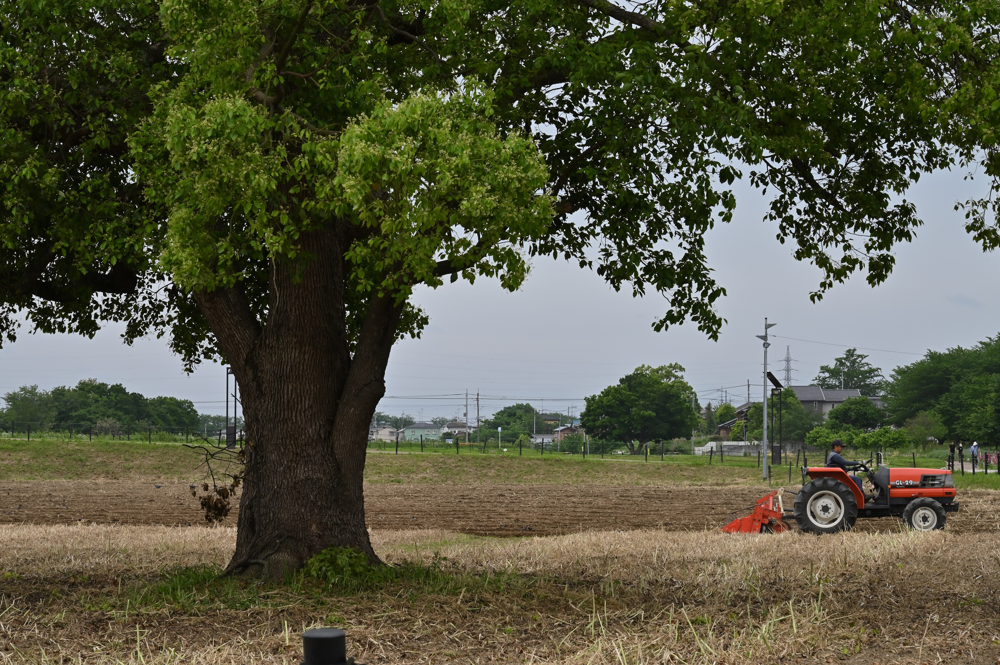

旅行スナップをしていると、物のスケールが特異的なことに心打たれることがしばしばある。
そのときに、そのスケールを伝えるために物の全体を写してしまいがちだが、これは写真としての魅力を激減させてしまう。

写真で何かイメージを伝えるときには、その対象をそのまま理解してもらうことに重きを置いてはいけない。
スケールの大きさを仄めかすヒントさえあれば十分である。

次の写真のように、木の全体を画角に抑えなくてもその木の大きさは十分伝わるだろう。
そこに想像の余地を持たせることで見る者に気づかせることが、その写真の意図を伝えることになる。

はじめは一見何気ない写真にみえることが大事で、何もないはずだと探し回る。そこで最初に見つけてほしいイメージがそれになるように配置する。

スケールの場合は物と物をわかりやすい位置に置く。今回は木の幹と人である。

特に風景写真では山のスケールを伝えたいことが多い。
その時に山の全部を写すと、情報量が大きくなる。こんなに大きい山が背後にたたずんでいるという情報だけを伝えるには別にすべてを写す必要がない。
「きっと後ろの山は大きいんだろう」と思わせるに十分な量だけ山が見えていれば十分である。